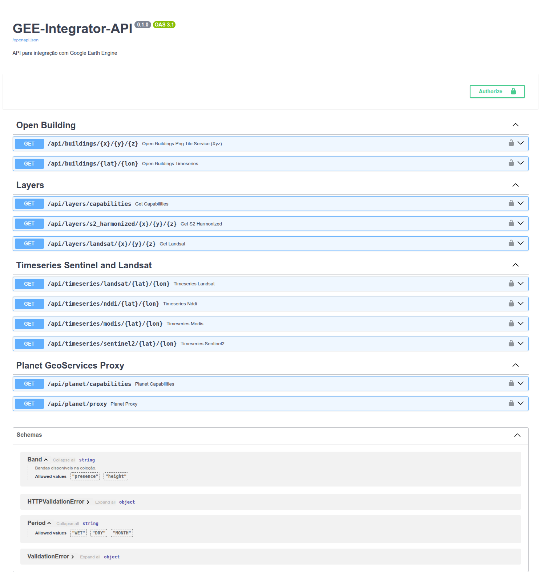
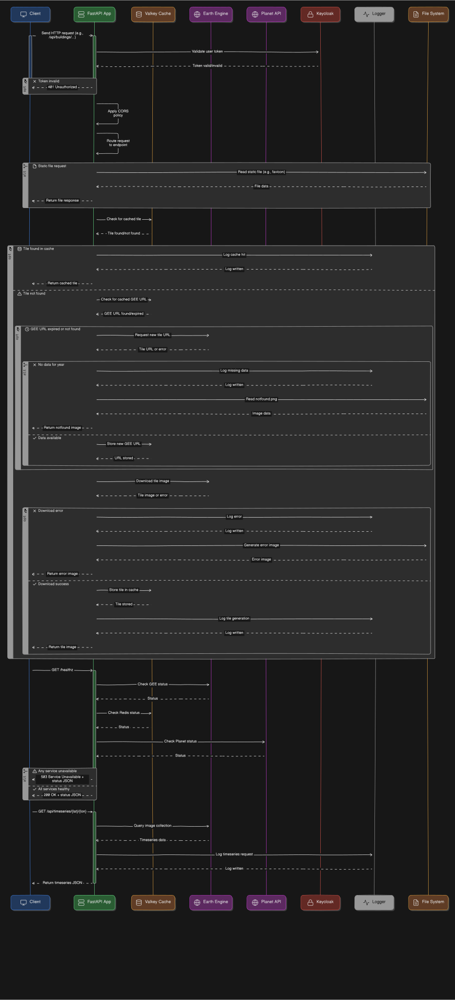

# GEEIntegratorAPI

A GEEIntegratorAPI é uma API REST desenvolvida em FastAPI que simplifica a integração com o Google Earth Engine (GEE), permitindo acesso e manipulação eficientes de dados geoespaciais. Ideal para desenvolvedores e cientistas de dados, esta API facilita a visualização e análise de imagens de satélite, como Sentinel-2 e Landsat, com suporte a filtros temporais e parâmetros de visualização personalizados.



## Principais Características

* Integração com Google Earth Engine (GEE)
    * Autenticação segura via conta de serviço do Google Cloud.
    * Acesso a coleções de imagens Sentinel-2 Harmonized e Landsat.
    * Filtros por data, período (seco, úmido, mensal) e parâmetros de visualização.
* Cache de Dados com Valkey
    * Armazenamento em cache de URLs de camadas de imagens e tiles para reduzir o tempo de resposta.
    * Gerenciamento de cache baseado em tempo de vida configurável (LIFESPAN_URL).
* Endpoints para Visualização de Imagens
    * Sentinel-2 Harmonized: suporte a índices de vegetação e filtros temporais.
    * Landsat (5, 7, 8, 9): ajustes de escala e parâmetros de visualização específicos.
* Suporte a Zoom e Geohash
    * Níveis de zoom de 10 a 18.
    * Otimização de recuperação de dados com Geohash.
    * Imagens em formato PNG para uso em aplicações web e móveis.
* Configurações de CORS
    * Permite acesso de diferentes domínios e subdomínios dinâmicos.
* Logs e Tratamento de Erros
    * Logs detalhados para monitoramento e depuração.
    * Respostas de erro personalizadas (imagens em branco, mensagens de erro).




## Tecnologias Utilizadas

-   **FastAPI:** Criação da API com alta performance e suporte a operações assíncronas.
-   **Google Earth Engine (GEE):** Acesso e processamento de dados geoespaciais.
-   **Valkey (Redis fork):** Cache de dados para otimização de desempenho.
-   **ORJSON:** Serialização eficiente de respostas JSON.
-   **Aiohttp:** Requisições assíncronas a APIs externas.

## Exemplos de Uso

-   **Visualização de Imagens Sentinel-2:**

    ```bash
    GET /api/s2_harmonized/{x}/{y}/{z}?period=WET&year=2023&visparam=s2-red
    ```

-   **Visualização de Imagens Landsat:**

    ```bash
    GET /api/landsat/{x}/{y}/{z}?period=MONTH&year=2022&visparam=landsat-false&month=6
    ```

## Benefícios

-   **Eficiência:** Cache e processamento assíncrono para respostas rápidas.
-   **Flexibilidade:** Suporte a múltiplas coleções de imagens e parâmetros de visualização.
-   **Escalabilidade:** Design escalável com suporte a sistemas de filas e armazenamento distribuído.


## Licença

Este projeto é licenciado sob a Licença MIT - veja o arquivo [LICENSE](LICENSE) para detalhes.


